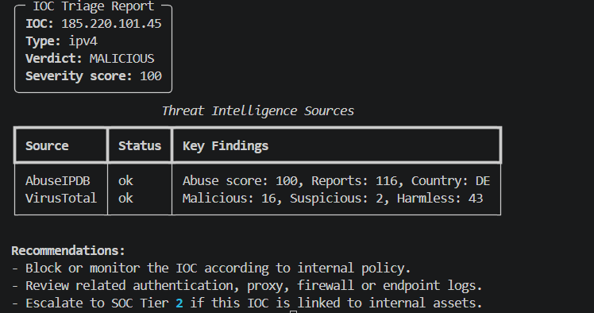

# ioc-triage-cli

A small Python CLI for the first step of SOC triage: taking an Indicator of Compromise, detecting its type, enriching it with passive Threat Intelligence sources, calculating a basic verdict, and printing or exporting a report.

The tool currently supports IOC type detection, AbuseIPDB enrichment for IPv4 indicators, VirusTotal enrichment for IPv4/domain/URL/hash indicators, DNS A record lookup for domains, basic verdict scoring, formatted terminal reports with Rich, and JSON export for single IOC analysis.

This is not a SIEM, scanner, sandbox, or exploitation tool. It is a learning and portfolio project built around a realistic SOC triage workflow.

---

## Why I built this

I built this project as a practical introduction to junior SOC / Threat Intelligence workflows.

The goal was to simulate the first enrichment step an analyst may perform when reviewing an indicator: identify the IOC type, enrich it with passive sources, calculate a basic verdict, and prepare a readable report.

The project is intentionally limited in scope. It focuses on safe, passive analysis and clear reporting rather than scanning, exploitation, or replacing analyst judgment.

---

## What it does

The tool accepts an IOC from the command line or from a text file, identifies its type, runs passive enrichment depending on the IOC type, calculates a basic verdict, and displays a readable triage report.

Current supported IOC types:

* IPv4
* domain
* URL
* MD5
* SHA256

Current enrichment behavior:

| IOC type | Enrichment sources     |
| -------- | ---------------------- |
| IPv4     | AbuseIPDB, VirusTotal  |
| domain   | DNS Lookup, VirusTotal |
| URL      | VirusTotal             |
| MD5      | VirusTotal             |
| SHA256   | VirusTotal             |
| unknown  | No enrichment          |

Current verdict levels:

* `MALICIOUS`
* `SUSPICIOUS`
* `CLEAN / UNKNOWN`

The project intentionally avoids calling an IOC `SAFE`. Lack of detections does not prove that an indicator is harmless.

---

## Example output

Example command:

```bash
python -m ioc_triage 185.220.101.45
```

Example report:



Text fallback example:

```text
╭──────────── IOC Triage Report ─────────────╮
│ IOC: 185.220.101.45                       │
│ Type: ipv4                                │
│ Verdict: MALICIOUS                        │
│ Severity score: 100                       │
╰───────────────────────────────────────────╯

          Threat Intelligence Sources
┏━━━━━━━━━━━┳━━━━━━━━┳━━━━━━━━━━━━━━━━━━━━━━━━━━━━━━━━━━━━━━┓
┃ Source    ┃ Status ┃ Key Findings                         ┃
┡━━━━━━━━━━━╇━━━━━━━━╇━━━━━━━━━━━━━━━━━━━━━━━━━━━━━━━━━━━━━━┩
│ AbuseIPDB │ ok     │ Abuse score: 100, Reports: 115       │
│ VirusTotal│ ok     │ Malicious: 19, Suspicious: 1         │
└───────────┴────────┴──────────────────────────────────────┘

Recommendations:
- Block or monitor the IOC according to internal policy.
- Review related authentication, proxy, firewall or endpoint logs.
- Escalate to SOC Tier 2 if this IOC is linked to internal assets.
```

If the input is not recognized:

```bash
python -m ioc_triage not-a-valid-ioc
```

```text
╭─── IOC Triage Report ────╮
│ IOC: not-a-valid-ioc     │
│ Type: unknown            │
│ Verdict: CLEAN / UNKNOWN │
│ Severity score: 0        │
╰──────────────────────────╯

Recommendations:
- Unsupported or invalid IOC format. Verify the input value.
```

---

## Getting started

Clone the repository:

```bash
git clone https://github.com/macus450-crypto/ioc-triage-cli.git
cd ioc-triage-cli
```

Create a virtual environment:

```bash
python -m venv .venv
```

Activate the virtual environment:

```bash
# Windows
.venv\Scripts\activate

# Linux/macOS
source .venv/bin/activate
```

Install dependencies:

```bash
pip install -r requirements.txt
```

The project uses:

* `requests` for AbuseIPDB and VirusTotal API requests
* `python-dotenv` for loading environment variables
* `dnspython` for DNS lookup
* `rich` for formatted terminal output
* `pytest` for tests

---

## Environment variables

The project loads configuration from environment variables using `python-dotenv`.

Create a local `.env` file based on `.env.example`:

```env
VIRUSTOTAL_API_KEY=
ABUSEIPDB_API_KEY=
REQUEST_TIMEOUT=10
```

Environment variables:

| Variable             | Purpose                                                              |
| -------------------- | -------------------------------------------------------------------- |
| `ABUSEIPDB_API_KEY`  | API key for AbuseIPDB IPv4 enrichment                                |
| `VIRUSTOTAL_API_KEY` | API key for VirusTotal IPv4, domain, URL, MD5, and SHA256 enrichment |
| `REQUEST_TIMEOUT`    | Timeout value for HTTP requests and DNS lookup                       |

You can obtain API keys by creating accounts in:

* [VirusTotal Community](https://www.virustotal.com/gui/join-us)
* [AbuseIPDB](https://www.abuseipdb.com/register)

Both providers offer API access suitable for basic personal testing, but free-tier limits and available features may change over time.

The actual `.env` file should not be committed.

If an API key is missing, the related enrichment source is skipped and the report continues with the remaining available data.

---

## Usage

Single IOC mode:

```bash
python -m ioc_triage 185.220.101.45
python -m ioc_triage example.com
python -m ioc_triage http://example.com/login
python -m ioc_triage 44d88612fea8a8f36de82e1278abb02f
python -m ioc_triage e3b0c44298fc1c149afbf4c8996fb92427ae41e4649b934ca495991b7852b855
```

File mode:

```bash
python -m ioc_triage --file examples/sample_iocs.txt
```

The file should contain one IOC per line. Empty lines and lines starting with `#` are skipped.

Example input file:

```text
# Sample IOC list for local testing.
192.0.2.10
example.com
http://example.com/login
44d88612fea8a8f36de82e1278abb02f
e3b0c44298fc1c149afbf4c8996fb92427ae41e4649b934ca495991b7852b855
```

Export a single IOC report to JSON:

```bash
python -m ioc_triage 185.220.101.45 --export examples/sample_output.json
```

Current limitation: JSON export is implemented for single IOC mode. File mode prints reports for each IOC, but does not yet export all results into one combined JSON file.

---

## JSON export example

Example exported report:

```json
{
    "ioc": "185.220.101.45",
    "ioc_type": "ipv4",
    "verdict": "MALICIOUS",
    "severity_score": 100,
    "sources": [
        {
            "source": "AbuseIPDB",
            "status": "ok",
            "abuse_confidence_score": 100,
            "total_reports": 115,
            "country_code": "DE",
            "isp": "Network for Tor-Exit traffic.",
            "domain": "for-privacy.net",
            "usage_type": "Commercial"
        },
        {
            "source": "VirusTotal",
            "status": "ok",
            "malicious": 19,
            "suspicious": 1,
            "harmless": 42,
            "undetected": 29
        }
    ],
    "recommendations": [
        "Block or monitor the IOC according to internal policy.",
        "Review related authentication, proxy, firewall or endpoint logs.",
        "Escalate to SOC Tier 2 if this IOC is linked to internal assets."
    ]
}
```

---

## What I learned

While building this project, I practiced:

* structuring a Python CLI project into smaller modules
* detecting different IOC types such as IPv4, domains, URLs, MD5 and SHA256 hashes
* using external Threat Intelligence APIs in a safe, passive way
* handling operational API issues such as missing keys, timeouts, rate limits and invalid responses
* working with DNS lookups and understanding how domain indicators can be enriched
* designing a simple verdict and severity scoring system
* creating readable analyst-style terminal reports and JSON output
* writing tests for IOC detection and verdict scoring

---

## Project structure

```text
ioc-triage-cli/
│
├── examples/
│   ├── invalid_output.json
│   ├── sample_iocs.txt
│   └── sample_output.json
│
├── ioc_triage/
│   ├── enrichers/
│   │   ├── __init__.py
│   │   ├── abuseipdb.py
│   │   ├── dns_lookup.py
│   │   └── virustotal.py
│   ├── __init__.py
│   ├── __main__.py
│   ├── cli.py
│   ├── config.py
│   ├── detectors.py
│   ├── models.py
│   ├── reporter.py
│   └── verdict.py
│
├── screenshots/
│   └── ioc-triage-demo-output.png
│
├── tests/
│   ├── test_detectors.py
│   └── test_verdict.py
│
├── .env.example
├── .gitignore
├── LICENSE
├── requirements.txt
└── README.md
```

Main files:

| File                                     | Purpose                                                                                                                            |
| ---------------------------------------- | ---------------------------------------------------------------------------------------------------------------------------------- |
| `ioc_triage/cli.py`                      | Argument parsing, single IOC mode, file mode, enrichment orchestration, verdict calculation, report printing, and JSON export call |
| `ioc_triage/detectors.py`                | IOC type detection logic                                                                                                           |
| `ioc_triage/enrichers/abuseipdb.py`      | AbuseIPDB lookup for IPv4 indicators                                                                                               |
| `ioc_triage/enrichers/virustotal.py`     | VirusTotal lookup for IPv4, domains, URLs, MD5 hashes, and SHA256 hashes                                                           |
| `ioc_triage/enrichers/dns_lookup.py`     | DNS A record lookup for domains                                                                                                    |
| `ioc_triage/verdict.py`                  | Basic verdict and severity score calculation                                                                                       |
| `ioc_triage/reporter.py`                 | Rich terminal report and JSON export logic                                                                                         |
| `ioc_triage/config.py`                   | Loads API keys and request timeout from environment variables                                                                      |
| `ioc_triage/__main__.py`                 | Allows the tool to run with `python -m ioc_triage`                                                                                 |
| `examples/sample_iocs.txt`               | Example input file for file mode                                                                                                   |
| `examples/sample_output.json`            | Example JSON report for a malicious IPv4 indicator                                                                                 |
| `examples/invalid_output.json`           | Example JSON report for an invalid IOC                                                                                             |
| `screenshots/ioc-triage-demo-output.png` | Screenshot showing example terminal output                                                                                         |
| `tests/test_detectors.py`                | Tests for IOC detection logic                                                                                                      |
| `tests/test_verdict.py`                  | Tests for verdict and severity scoring logic                                                                                       |
| `.env.example`                           | Example environment configuration                                                                                                  |
| `LICENSE`                                | MIT License file                                                                                                                   |

`models.py` is currently reserved for future normalized result models.

---

## Detection logic

Detection lives in `detectors.py` and is split into small functions:

* `is_ipv4()`
* `is_url()`
* `is_domain()`
* `is_md5()`
* `is_sha256()`
* `detect_ioc_type()`

Current detection order:

```text
URL → IPv4 → MD5 → SHA256 → domain → unknown
```

Order matters because some values can match multiple patterns depending on how broadly they are defined.

---

## Enrichment logic

After the IOC type is detected, the CLI calls the matching enrichment functions.

| IOC type | Enrichment sources                                            |
| -------- | ------------------------------------------------------------- |
| IPv4     | AbuseIPDB, VirusTotal                                         |
| domain   | DNS Lookup, VirusTotal                                        |
| URL      | VirusTotal                                                    |
| MD5      | VirusTotal                                                    |
| SHA256   | VirusTotal                                                    |
| unknown  | No enrichment; returns unsupported/invalid IOC recommendation |

### AbuseIPDB

IPv4 indicators are passed to `check_ip_abuseipdb()`.

The current AbuseIPDB integration handles:

* missing API key
* successful response
* rate limit response
* non-200 HTTP response
* timeout
* request error
* invalid JSON response

Returned fields include:

* `abuse_confidence_score`
* `total_reports`
* `country_code`
* `isp`
* `domain`
* `usage_type`

### VirusTotal

IPv4, domain, URL, MD5, and SHA256 indicators are passed to the proper VirusTotal helper.

The current VirusTotal integration handles:

* missing API key
* successful response
* rate limit response
* non-200 HTTP response
* timeout
* request error
* invalid JSON response

The output focuses on `last_analysis_stats`:

* `malicious`
* `suspicious`
* `harmless`
* `undetected`

For URLs, the tool encodes the URL into the VirusTotal URL identifier before querying the API.

### DNS lookup

Domain indicators are passed to `resolve_domain()`.

The current DNS lookup checks A records and handles:

* successful resolution
* domain not found
* existing domain with no A record
* timeout
* DNS-related errors

The result uses `source: "DNS Lookup"` and returns resolved IPv4 addresses in `resolved_ips` when available.

---

## Verdict logic

Verdict calculation lives in `verdict.py`.

The current scoring is intentionally simple and based on available enrichment results:

### AbuseIPDB rules

| Condition                      | Verdict impact                           |
| ------------------------------ | ---------------------------------------- |
| `abuse_confidence_score >= 80` | `MALICIOUS`                              |
| `abuse_confidence_score >= 25` | `SUSPICIOUS`, unless already `MALICIOUS` |

### VirusTotal rules

| Condition        | Verdict impact                           |
| ---------------- | ---------------------------------------- |
| `malicious >= 5` | `MALICIOUS`                              |
| `malicious >= 1` | `SUSPICIOUS`, unless already `MALICIOUS` |
| `suspicious > 0` | `SUSPICIOUS`, unless already `MALICIOUS` |

If no strong malicious or suspicious signals are found, the result stays as:

```text
CLEAN / UNKNOWN
```

This means no strong signal was found in the available sources. It does not mean the IOC is guaranteed to be safe.

---

## Reporting

The reporting layer lives in `reporter.py`.

It currently provides:

* a Rich summary panel with IOC, type, verdict, and severity score
* a Rich table with Threat Intelligence sources and key findings
* analyst-style recommendations based on the verdict
* JSON export through `export_json()`

The report is designed to be readable in the terminal and useful for a junior SOC-style triage workflow.

---

## Tests

Run tests with:

```bash
python -m pytest
```

Current test coverage:

* valid IPv4 detection
* valid domain detection
* valid URL detection
* valid MD5 detection
* valid SHA256 detection
* invalid IPv4 handling
* invalid domain handling
* unknown input handling
* malicious verdict from AbuseIPDB result
* suspicious verdict from AbuseIPDB result
* malicious verdict from VirusTotal result
* suspicious verdict from VirusTotal malicious detection
* suspicious verdict from VirusTotal suspicious detection
* clean/unknown verdict when no strong indicators are found
* ignoring skipped or error sources during verdict calculation
* keeping a malicious verdict when a weaker suspicious source appears later

Current limitation: enrichment modules, reporter output, and JSON export are not fully covered by tests yet.

---

## Current workflow

```text
Input IOC
  → Detect IOC type
  → Run matching passive enrichment sources
  → Calculate basic verdict and severity score
  → Print formatted terminal report
  → Optionally export single IOC report to JSON
```

---

## Roadmap

Done:

* [x] CLI entry point with `python -m ioc_triage`
* [x] Single IOC mode
* [x] File mode
* [x] IOC type detector
* [x] Detector tests
* [x] Verdict scoring tests
* [x] `.env.example`
* [x] Load configuration from environment variables
* [x] AbuseIPDB enrichment for IPv4 indicators
* [x] VirusTotal enrichment for IPv4, domains, URLs, MD5, and SHA256
* [x] DNS A record lookup for domains
* [x] Basic verdict scoring
* [x] Severity score
* [x] Rich terminal report
* [x] Analyst-style recommendations
* [x] JSON export for single IOC mode
* [x] Example JSON reports
* [x] Screenshot/demo output for GitHub README

Next:

* [ ] Add tests for AbuseIPDB, VirusTotal, DNS lookup, reporter logic, and JSON export
* [ ] Add combined JSON export for file mode
* [ ] Normalize enrichment results with dedicated models
* [ ] Add Markdown report export
* [ ] Improve error reporting in the Rich table for skipped, timeout, rate-limited, and error sources
* [ ] Add more realistic sample IOC reports
* [ ] Add phishing URL analysis module

---

## Notes

This tool is for passive IOC triage only.

It does not:

* scan hosts
* exploit systems
* brute force services
* download malware
* submit automatic abuse reports
* modify external systems

Threat Intelligence data always needs context. Public sources can miss threats, return outdated information, or produce false positives. The tool is meant to support triage, not replace analyst judgment.

---

## License

This project is licensed under the MIT License.
